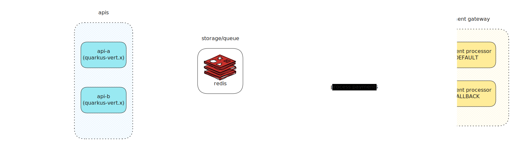

# Rinha de Backend 2025 - Quarkus(native) with Redis

This project implements a resilient backend for
the [Rinha de Backend 2025](https://github.com/zanfranceschi/rinha-de-backend-2025) challenge.  
It handles **payment processing with limited resources**, managing a **high volume of requests** even with minimal
infrastructure.  
The main focus is on building a **robust and fault-tolerant system** that can operate reliably under constrained
conditions.

The backend is built using [Quarkus](https://quarkus.io/), with **native compilation via GraalVM**, **Java 21**, and
**Redis** for distributed caching.

## System Architecture



## Technologies

- **Language:** Java 21
- **Framework:** Quarkus 3 (with Vert.x)
- **Storage / Queue:** Redis
- **Compilation:** GraalVM (native)
- **Containerization:** Docker
- **Load Balancer:** Nginx

## Features

- Resilient payment processing
- Automatic fallback between gateways
- Integrated services health checks
- Redis queue system with asynchronous workers
- Distributed cache with Redis

## Getting Started

Follow the steps below to run the project locally:

1. Build the **producer** and **consumer** modules with native GraalVM compilation:

```bash
./mvnw clean package
```

2. Start the full environment with Docker Compose:

```bash
docker compose up
```